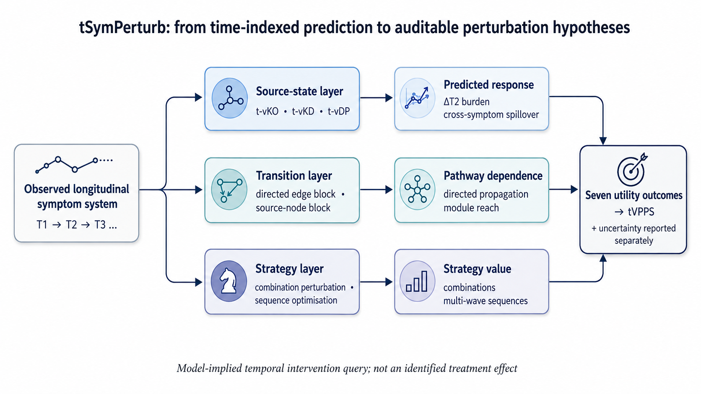

# tSymPerturb

**English** | [简体中文](README.zh-CN.md)

**tSymPerturb** evaluates how changes to symptom states and directed pathways propagate through a fitted longitudinal symptom network. It supports six analyses: **virtual knockout, virtual knockdown, virtual dosage perturbation, communication blocking, combination perturbation and intervention-sequence optimization**. Seven utility outcomes summarize candidate targets, and tVPPS ranks them within the specified candidate set. Uncertainty is reported separately.

## Framework overview

[](docs/figures/figure1.png)

*Figure 1 from the author-supplied manuscript package, reproduced unchanged with the author's permission. Open the image for full resolution. [Figure provenance](docs/figures/README.md).*

Source-state analyses change symptoms at T1. Communication blocking changes the fitted T1→T2 pathways. Combination and sequence analyses compare joint or ordered strategies. All results are model-implied intervention hypotheses; clinical benefit requires independent validation.

The seven-utility profile combines full-dose state responses, source-node blocking and prespecified pair values. Dose curves, edge effects and sequence trajectories are reported separately. Analysis can start from a fitted model or matched two-wave observations.

## What this repository contains

| Resource | Purpose |
|---|---|
| [Agent Skill](skills/tsymperturb/SKILL.md) | Design, run, audit and interpret a temporal perturbation analysis |
| [NumPy reference implementation](skills/tsymperturb/scripts/tsymperturb.py) | Fixed-model operators, moments, seven utilities and JSON scoring CLI |
| [Optional fitting adapter](skills/tsymperturb/scripts/fit_tsymperturb.py) | Matched two-wave Lasso fitting and complete-pipeline participant bootstrap |
| [22-symptom model](examples/synthetic_model.json) / [paired observations](examples/synthetic_paired.json) | Constructed examples with 22 symptoms and four modules |
| [Strategy demonstration](examples/strategy_demo.py) | Propagation, repeated additional improvements, bounds and acquisition ordering |
| [English methods](docs/METHODS.md) / [Chinese methods](docs/zh-CN/METHODS.md) | Mathematical assumptions and reporting requirements |
| [Detailed equation contract](skills/tsymperturb/references/methods.md) | Manuscript equation numbers, estimands and implementation conventions |
| [Independent validation](docs/VALIDATION_REPORT.md) | Numerical oracles, Monte Carlo checks, tested workflows and limitations |

The presentation follows the organization of the [SymPerturb Chinese README](https://github.com/zfrory15-max/SymPerturb/blob/main/README_zh-CN.md). The method is temporal: it uses directed, fitted transitions rather than a cross-sectional covariance inverse or equilibrium network. The two frameworks' seven utility definitions are not interchangeable.

## Temporal virtual-perturbation model

The two-wave reference model is

```text
X2 = a + B X1 + ε
μ2 = a + B μ1
Σ2 = B Σ1 Bᵀ + Ψ
```

`B[j,i]` is the path **from symptom i at T1 to symptom j at T2**. Columns are outgoing profiles; diagonal terms retain autoregressive persistence. All symptoms must be oriented so higher values mean worse states. Anchors `c` are clinically defined source states, expressed in the same coordinates as the fitted source variables. If variables are standardized, use `c_z = (c_raw − μ1_raw) / SD1_raw`; a standardized zero is generally the sample mean, not symptom absence.

A general location–scale perturbation changes target means and residual variation separately. For target set S:

```text
X1,S* = cS + Dμ(μ1,S − cS) + Dσ(X1,S − μ1,S)
R = μ2 − μ2* = B(μ1 − μ1*)
Σ2* = B Σ1* Bᵀ + Ψ
```

Non-target source coordinates stay unchanged; target–non-target covariances must be scaled as well as target variances. The linked reference map uses `Dμ = Dσ = diag(1 − dose)`. The API also supports independent attenuating residual multipliers, including location-only and scale-only queries. Its range is [0,1]; arbitrary variance-inflating maps are outside this implementation.

## Six perturbation analyses

### 1. Virtual knockout (t-vKO)

Set source symptom i to its anchor: `X1,i* = ci`. Its variance and cross-covariances become zero, giving the full-dose response `R_i = B[:,i](μ1,i − ci)`. Keep `B`, `a` and `Ψ` fixed; do not refit or re-standardize the constant source column. A singular perturbed source covariance is valid for forward propagation.

### 2. Virtual knockdown (t-vKD)

Apply a partial shift toward the anchor:

```text
X1,i* = ci + (1 − d)(X1,i − ci),  0 < d < 1
```

The mean distance from the anchor scales by `1−d`, variance by `(1−d)²`, and target–non-target covariance by `1−d`. The general location–scale API above also allows mean and residual variation to change independently.

### 3. Virtual dosage perturbation (t-vDP)

Dosage perturbation uses the **dose-parametrized operator family** `T_i(d): X1,i → ci + (1−d)(X1,i−ci)`, for `d ∈ [0,1]`. At d=0 the source is unchanged, intermediate doses give knockdown, and d=1 gives knockout. Evaluating this family over a prespecified grid produces the dose-response profile. The manuscript calls this grid evaluation an intensity-response procedure; its underlying state map is an operator (Methods Eqs. 23–27).

For the fixed, unbounded linear model, `R_i(d)=dR_i(1)`. A nonlinear curve requires an additional nonlinear element, such as an explicitly bounded outcome. Dose represents perturbation intensity and is not a calibrated clinical dose.

### 4. Communication blocking

Directed edge blocking applies `B*[j,i] = (1−q)B[j,i]`. Source-node blocking applies `B*[:,i] = (1−q)B[:,i]`; the reference includes autoregression, while `cross_only=True` preserves `B[i,i]`.

With the source reference profile and intercept fixed, the signed effect is `(B − B*) x_ref`. Communication-block utility instead measures the change in unsigned finite-horizon route capacity:

```text
Q_H(B) = 1ᵀ [Σ(h=1…H) (γ |B|)^h] 1
```

Take elementwise absolute values before matrix powers, and specify `H`, `γ` and `q`. Reduced capacity can coexist with symptom worsening. For a centered source population, the population-mean signed blocking effect is zero.

### 5. Combination perturbation

Apply joint source shifts and compare the pair with both single targets on the same outcomes, excluding both target outcomes and using the same weights. Retain the signed increment over the better single and the additive interaction contrast.

The linear reference model gives `R_{i,k}=R_i+R_k`, including with correlated sources. A linear common-outcome utility therefore has zero additive interaction contrast. A positive increment over the better single alone does not establish synergy.

### 6. Intervention-sequence optimization

For observed wave transitions, a one-time improvement propagates chronologically as `B_(t+h−1)…B_t δ_t`. Repeated additional pre-transition improvements follow `Δ⁻_(t+1)=B_t(Δ⁻_t+u_t)`. Here `u_t` specifies an additional improvement; repeated knockout requires its own state-dependent definition. Reusing a two-wave matrix as `B^h` assumes stationarity.

The acquisition solver addresses a separate decision problem: which fixed-length order maximizes an additive discounted objective? It searches at most nine prespecified candidates with nonnegative costs. The 22-symptom example selects the top eight by tVPPS for a two-target search. This is a model-based acquisition order, not evidence of biological treatment timing.

See the [equation reference](skills/tsymperturb/references/methods.md) and [API guide](skills/tsymperturb/references/input-output.md) for full definitions and signatures.

## Seven utilities and tVPPS

The reference source-state utilities use full dose. Write `Δji = Rj←i / s2,j`, with the **unperturbed model-implied follow-up SD** `s2,j = sqrt((BΣ1Bᵀ+Ψ)[j,j])`, fixed across perturbations. Positive values indicate predicted improvement; negative values indicate worsening.

| Utility | Exact reference definition | Key convention |
|---|---|---|
| **1. Downstream efficacy** | `Σj wj Δji / Σj wj` | All T2 outcomes, **including the target's own outcome** (Eq. 47) |
| **2. Cross-symptom spillover** | `Σ(j≠i) wj Δji / Σ(j≠i) wj` | Excludes the target outcome and renormalizes weights (Eq. 48) |
| **3. Breadth** | Fraction of the p−1 non-target outcomes with `Δji ≥ τ` | Unweighted count; reference `τ=0.05 SD` (Eq. 49) |
| **4. Cross-module reach** | Fraction of other modules whose mean `Δji ≥ τm` | Unweighted mean within each module, then equal module counting; reference `τm=0.03 SD` (Eq. 50) |
| **5. Communication-block value** | `[Q_H(B)−Q_H(B_block_i)] / Q_H(B)` | Full outgoing-column block; reference `q=0.8`; H and γ must be stated (Eq. 35) |
| **6. Combination value** | Mean over prespecified partners k of `max(0, Iik)` | `Iik = Gik^(−ik) − max(Gi^(−ik), Gk^(−ik))`; all three use the same pair-excluded outcomes and weights (Eqs. 38–39) |
| **7. Spillover fraction** | `Σ(j≠i) wj max(Δji,0) / [Σj wj max(Δji,0)+10⁻¹²]` | Fraction of positive weighted benefit, not signed net benefit (Eq. 51) |

Normalize each dimension within the prespecified candidate set to 0–100 by min–max scaling. A constant dimension receives **50**, including when there is only one candidate. tVPPS is the weighted average of these seven normalized dimensions, with nonnegative utility weights and a positive total. Equal weights are a methodological reference, not validated clinical preferences.

Always report the raw seven-dimensional profile alongside the score. **Robustness is not an eighth dimension.** Dose efficiency and low-dose responsiveness are redundant with efficacy in the linear reference case and are not additional temporal utility dimensions. A high positive spillover fraction can coexist with harmful outcomes; inspect the full signed response profile.

## Installation and quick start

Python **3.10+** is required. Run from the repository root:

```bash
python -m venv .venv
# macOS / Linux
source .venv/bin/activate
# Windows PowerShell instead:
# .venv\Scripts\Activate.ps1
python -m pip install -r requirements.txt
python skills/tsymperturb/scripts/tsymperturb.py examples/synthetic_model.json --output outputs/synthetic_results.json
```

This is a portable skill script, not an editable-install distribution: use the commands above rather than `pip install -e .`. `--output` is required and overwrites an existing path; choose a new filename when preservation matters.

Run the strategy example and tests:

```bash
python examples/strategy_demo.py
python -m pip install -r requirements-dev.txt
# Includes SciPy, required by the independent numerical audit
python -m pip install -r requirements-fitting.txt
python -m pytest -q
python docs/validation/run_audit.py
python docs/validation/audit_synthetic22.py
python docs/validation/mc_audit.py
```

### Install the Agent Skill

Copy the complete `skills/tsymperturb/` directory, including scripts and references, into your agent's skills directory. For local Codex on macOS/Linux:

```bash
mkdir -p "${CODEX_HOME:-$HOME/.codex}/skills"
cp -R skills/tsymperturb "${CODEX_HOME:-$HOME/.codex}/skills/"
```

Back up an existing skill before replacement. Other compatible agents may use a different path. Example request:

> Use tSymPerturb to audit my fitted T1→T2 model. Check orientation, anchors and scale; evaluate all seven utilities; retain adverse signed effects; report tVPPS, pair increments and the assumptions behind any sequence analysis.

## Use your own model or data

### Route A: an already fitted model

Prepare JSON following [synthetic_model.json](examples/synthetic_model.json). The core accepts JSON, not CSV.

| Input group | Required information |
|---|---|
| Identities and direction | Identical ordered source/outcome labels, `orientation="outcome_by_source"`, `higher_is_worse=true` and an explicit scale description |
| Fitted model | `B`, `intercept`, source `mu1` and `sigma1`, residual covariance `psi` |
| Scientific definitions | Fitted-scale `anchors`, one module per symptom, at least two modules |
| Scoring plan | Explicit candidates, non-self partner sets, outcome weights, seven utility weights, propagation horizon and damping |
| Optional requests | State doses and independent residual scale factors; threshold and block-fraction overrides |

1. Fit and validate the longitudinal model; record wave intervals, matching and preprocessing.
2. Orient scales and transform original-scale anchors with the fitted source mean/SD.
3. Check matrix direction and label order. A source-by-outcome export requires an explicit transpose; preserve autoregressive diagonal terms.
4. Prespecify candidates, partners, modules, weights, thresholds, horizon and damping.
5. Run the scoring CLI and inspect signed profiles and raw utilities before interpreting ranks.

The complete seven-utility interface requires at least three symptoms, valid positive weights on every comparison set, and nonzero route capacity. Invalid/undefined cases are rejected rather than assigned fabricated scores. See the [full input/output contract](skills/tsymperturb/references/input-output.md).

### Route B: paired two-wave observations

```bash
python -m pip install -r requirements-fitting.txt
python skills/tsymperturb/scripts/fit_tsymperturb.py examples/synthetic_paired.json --n-boot 1000 --seed 42 --output outputs/bootstrap.json
python docs/validation/fit_audit.py
```

The adapter uses standardized per-outcome Lasso (`alpha=0.03`, no intercept by default). Each participant bootstrap replicate repeats paired-row resampling, wave-specific standardization, anchor transformation, fitting, perturbation, all seven utilities, normalization and ranking. Input rows must already be correctly matched; missing-data repair and clustered resampling are not implemented.

The constructed example contains 250 paired participants, 22 symptoms and four modules. `--n-boot 10` is useful only as a smoke test. Inspect failed replicates: selection frequencies and percentile summaries use successful replicates and can be biased by failures. Wilson intervals quantify finite-bootstrap Monte Carlo error, not clinical certainty or validated interval coverage.

Penalized residuals need not be empirically orthogonal to sources. Consequently, `BΣ1Bᵀ+Ψ` can differ from empirical T2 covariance. The adapter records source–residual covariance diagnostics; do not assume its structural covariance convention has been empirically verified. Details: [fitting and uncertainty](skills/tsymperturb/references/fitting-and-uncertainty.md).

## Main outputs

| JSON field | What to inspect |
|---|---|
| `candidates`, `dimensions` | Ordered labels for every score row and column |
| `raw`, `normalized`, `tvpps`, `ranks` | Seven raw utilities, normalized profiles, composite and descending competition ranks |
| `standardized_responses` | Candidate-by-outcome signed full-dose effects; retain predicted worsening |
| `pairs` | Common-outcome single and joint utilities, signed increments and additive contrasts |
| `baseline` | Unperturbed model-implied mean, covariance and SD |
| `config`, `scale`, `source_labels` | Reproducibility settings and coordinate conventions |
| `dose_results` | Requested source/outcome means, covariances and response profiles |

The core CLI writes JSON. Bounded-normal expectations, edge-level effects, multi-wave propagation and acquisition search are available through the Python APIs shown in the strategy demonstration.

## Example data and verification

All runnable examples use a **constructed 22-symptom, four-module system**. Labels S01–S22 and module groups A/B/C/D (6/6/5/5 symptoms) are illustrative. The fitted-model input, 250 paired observations and strategy demonstration share this system. Six example doses are 0, 0.2, 0.4, 0.6, 0.8 and 1.

```bash
# Rebuild the example inputs and metadata deterministically
python examples/generate_synthetic22.py
```

The construction uses 53 off-diagonal paths (47 positive, six negative) and parameter ranges described in the manuscript. Its spectral radius is approximately 0.7675, compared with 0.827 reported in the paper. The matrix, symptom/module assignments and observations are newly constructed, not the original research data. [Generation settings and provenance](examples/synthetic22_metadata.json) record seed 20261001.

The [validation report](docs/VALIDATION_REPORT.md) separates equation tests, constructed-data workflow checks and original-model reproduction. A participant bootstrap measures variation conditional on one dataset; it does not reproduce the manuscript's independent-dataset recovery experiment.

### Original-model verification

Original numerical reproduction remains **NOT_RUN**. The supplied materials do not contain the complete original generating matrices, ordered symptom/module map and machine-readable figure tables. The [strict22 runner](docs/validation/verify_manuscript22.py) requires author-supplied original inputs rather than substituting the constructed example.

```bash
# Without original inputs: expected exit code 2 (NOT_RUN)
python docs/validation/verify_manuscript22.py --output outputs/manuscript22_readiness.json

# With original generating parameters and verification settings
python docs/validation/verify_manuscript22.py author_model.json --output outputs/manuscript22_checks.json

# Constructed-input checker and operator regression tests
python -m pytest -q tests/test_manuscript22_contract.py
```

See the [input guide](docs/validation/MANUSCRIPT22_INPUTS.md), [readiness report](docs/validation/manuscript22_readiness.json) and [execution manifest](docs/validation/manuscript22_execution_manifest.json). The gate checks source declarations, dimensions, documented parameter constraints and deterministic identities. Passing returns **3 / PARTIAL_VERIFIED**; invalid or failed checks return **1**. Source declarations do not independently authenticate arrays.

The gate does not run the paper's 250,000-draw-per-target experiment, 600 independent-dataset recovery study, benchmark rankings or four-wave/repeated-intervention reproduction. Those require the original research inputs and remain separate from software verification.

## Interpreting results

Report signed response profiles and raw utilities alongside tVPPS. The score is relative to its candidate set and is not directly comparable across cohorts, networks or different candidate sets. Bootstrap and sensitivity analyses describe uncertainty under the specified analysis, not clinical effectiveness.

Bounded-normal expectations are an optional extension; clipping a mean alone is not equivalent. Missing-data handling, latent confounding control, ordinal/nonlinear model fitting, clinical validation and general constrained treatment scheduling are outside the current implementation.

## Citation, source and license

Method source: Zheng Zhu, Junwen Yu, Tiantian Hu, Zhongfang Yang and Jiaqing Wang, *tSymPerturb converts longitudinal symptom networks into time-indexed intervention strategies*, supplied manuscript dated **17 August 2026**. Operator/procedure definitions: Methods Eqs. 13–45; seven utilities/tVPPS: Table 2 and Eqs. 35, 38–39, 46–53; verification and uncertainty: Eqs. 54–58.

See [SOURCE.md](SOURCE.md) for provenance and [CONTRIBUTING.md](CONTRIBUTING.md) for checks. The supplied submission label is not treated as a public arXiv identifier or DOI. Cite the confirmed manuscript record and the actual repository commit/release used; no unverified DOI or release is asserted.

No redistribution license has been selected in this bundle. Authors should decide code/content licensing before reuse or formal release; see [LICENSING.md](LICENSING.md). Only the authorized framework figure is included; the manuscript PDF and private data are not redistributed. Before claiming publication-level reproduction, reconcile the reference implementation with original research code, validate the generating inputs, independently review the analysis and archive a versioned release.
